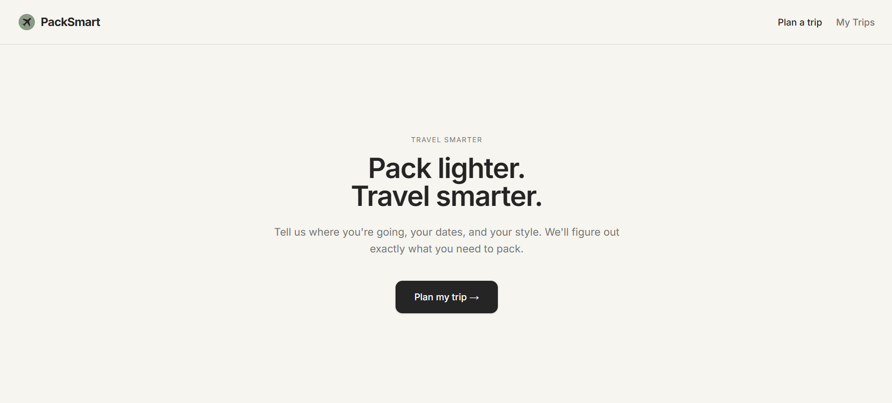
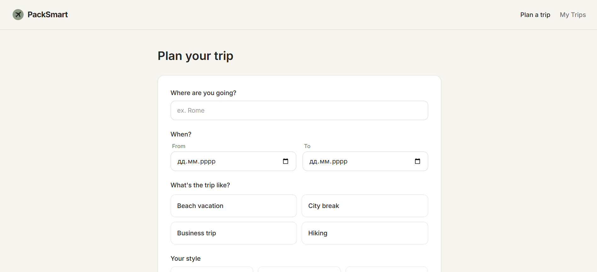
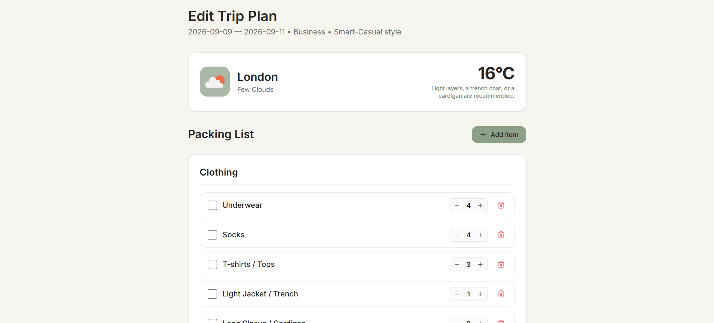
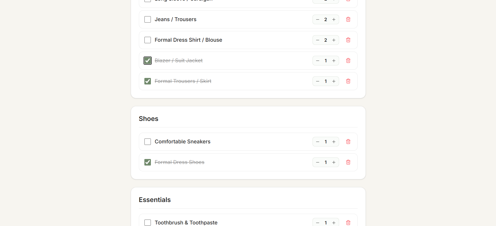
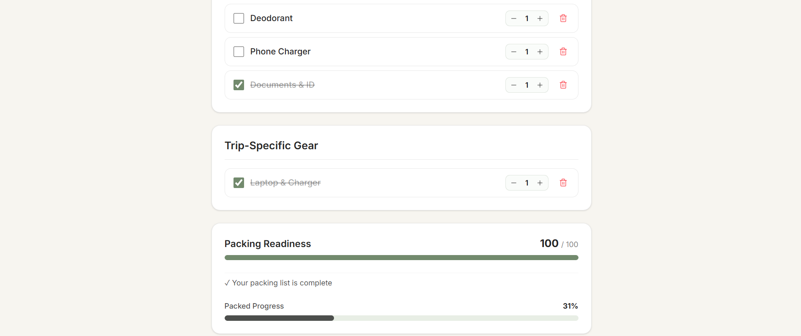
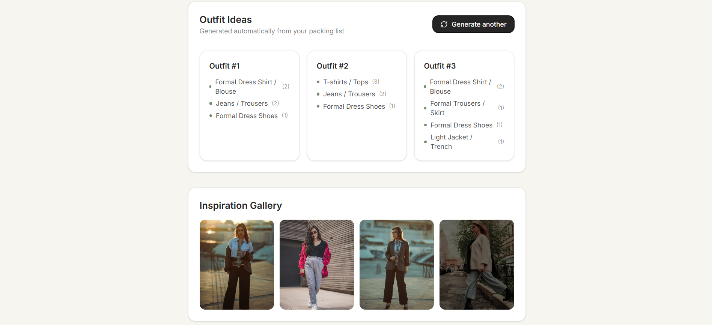
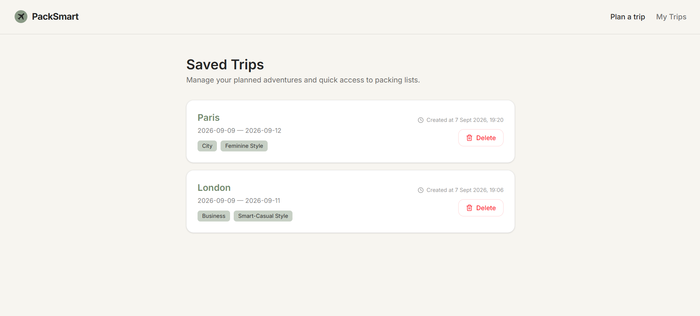

# PackSmart — Travel Smarter

PackSmart is a modern web application that helps you prepare for a trip without overthinking what to pack.

Enter your destination, travel dates, trip type, and preferred style — PackSmart uses weather conditions and trip details to generate a personalized packing list, suggest outfits, and help you keep track of everything you need.

## Live Demo

**[PackSmart — Live Demo](https://packsmart-flax.vercel.app/)**

**[GitHub Repository](https://github.com/SofiaUmrish/packsmart)**

---

## Features

### Personalized Packing Lists

PackSmart generates a packing list based on:

* trip duration
* destination weather
* temperature and weather conditions
* trip type
* preferred clothing style

Items are automatically organized into categories such as:

* Clothing
* Shoes
* Essentials
* Trip-Specific Gear

The recommended quantities also adapt to the length of the trip.

### Weather-Based Recommendations

Weather data is used to make packing recommendations more relevant to the planned trip.

Depending on the temperature and conditions, PackSmart can suggest items such as:

* jackets and coats
* sweaters
* jeans or trousers
* shorts
* sandals
* waterproof shoes
* sunscreen
* hats and gloves

This allows the packing list to adapt to different weather conditions instead of using a fixed checklist.

### Outfit Generator

PackSmart can generate outfit combinations from the clothing items included in the packing list.

Outfits are assembled from available:

* tops
* bottoms
* dresses
* outerwear
* shoes
* accessories

The generated outfits can then be viewed directly on the trip results page.

### Interactive Packing List

The packing list is interactive, allowing users to:

* check items as packed
* see packing progress
* keep track of required items
* work with categorized packing lists

### Packing Score

Each trip includes a packing score that provides a quick overview of packing progress and helps users understand how complete their list is.

### Inspiration Gallery

PackSmart includes an inspiration gallery with travel images fetched from **Unsplash**.

The gallery provides visual inspiration related to the selected destination and travel style, helping users get ideas for their trip beyond the packing list.

Images are dynamically loaded from the Unsplash API and displayed directly on the trip results page.

### Saved Trips

Users can save generated trips directly in their browser.

Saved trips include information such as:

* destination
* travel dates
* trip type
* style
* packing list
* weather information
* creation date and time

Saved trips can be reopened or deleted later.

Data is stored locally using the browser's `localStorage`, so no account is required.

### Responsive Design

The application is designed to work across:

* desktop
* tablet
* mobile

The UI follows a minimalist visual style with a soft `sage`, `charcoal`, and `ivory` color palette.

---

## How It Works

1. **Plan your trip**

   Enter your destination, travel dates, trip type, and preferred style.

2. **Get weather information**

   PackSmart retrieves weather data for the selected destination and travel period.

3. **Generate your packing list**

   The application analyzes the trip duration and weather conditions and creates a customized list of items to pack.

4. **Build outfits**

   Available clothing items can be combined into suggested outfits.

5. **Inspiration Gallery**

   PackSmart displays destination-related images from Unsplash to provide visual inspiration for the trip.

6. **Pack your things**

   Check items off the list as you pack and track your progress.

7. **Save your trip**

   Save the complete trip locally and return to it later.

---

## Tech Stack

| Technology       | Purpose                                 |
| ---------------- | --------------------------------------- |
| **Next.js**      | React framework and application routing |
| **TypeScript**   | Type-safe application development       |
| **Tailwind CSS** | Styling and responsive UI               |
| **Lucide React** | Interface icons                         |
| **localStorage** | Client-side saved trips                 |
| **Weather API**  | Weather data for trip planning          |
| **Unsplash API** | Travel inspiration images               |
| **Vercel**       | Deployment                              |

The project uses the Next.js App Router and is organized into application pages, reusable React components, utility functions, and TypeScript types.

---


## Getting Started

### Prerequisites

Make sure you have installed:

* Node.js
* npm

### Installation

Clone the repository:

```bash
git clone https://github.com/SofiaUmrish/packsmart.git
```

Navigate to the project directory:

```bash
cd packsmart
```

Install dependencies:

```bash
npm install
```

### Environment Variables

Create a `.env.local` file in the root directory and add the required API configuration:

```env
NEXT_PUBLIC_WEATHER_API_KEY=your_weather_api_key
UNSPLASH_ACCESS_KEY=your_unsplash_access_key

```

The weather API key is used for retrieving weather data for the selected destination.

The Unsplash access key is used server-side to fetch travel inspiration images for the Inspiration Gallery.

### Run the Development Server

```bash
npm run dev
```

Open:

```text
http://localhost:3000
```

The application should now be running locally.

---

## Deployment

PackSmart is deployed using Vercel.

**Live application:**
https://packsmart-flax.vercel.app/

---

## Screenshots

### Landing Page



### Trip Planner




### Generated Packing List





### Outfit Ideas / Inspiration Gallery



### Saved Trips



---

## Author

**Sofia Umrish**

[GitHub](https://github.com/SofiaUmrish)
